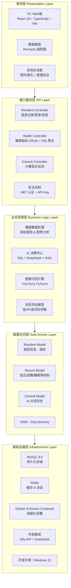

```mermaid
flowchart TB
    subgraph PresentationLayer["表现层 Presentation Layer"]
        direction LR
        Web["PC Web端<br/>React 18 + TypeScript + Vite"]
        Board["数据看板<br/>Recharts 趋势图"]
        Chat["咨询对话框<br/>即时通讯 + 管理后台"]
    end

    subgraph APILayer["接口服务层 API Layer"]
        direction LR
        Ctrl1["Resident Controller<br/>居民注册/登录/信息"]
        Ctrl2["Health Controller<br/>健康指标 CRUD + Dify 聚合"]
        Ctrl3["Consult Controller<br/>大模型对话流"]
        Security["安全机制<br/>JWT 认证 + API Key"]
    end

    subgraph BusinessLayer["业务逻辑层 Business Logic Layer"]
        direction LR
        HealthProc["健康数据处理<br/>指标提取 & 趋势分析"]
        AICenter["AI 决策中心<br/>Dify + DeepSeek + RAG"]
        YOLO["图像识别引擎<br/>YOLOv11 PyTorch"]
        Risk["风险评估模型<br/>低/中/高风险预警"]
    end

    subgraph DALayer["数据访问层 Data Access Layer"]
        direction LR
        Model1["Resident Model<br/>居民信息、病史"]
        Model2["Record Model<br/>血压/血糖/睡眠等指标"]
        Model3["Consult Model<br/>AI 对话历史"]
        ORM["ORM：SQLAlchemy"]
    end

    subgraph InfraLayer["基础设施层 Infrastructure Layer"]
        direction LR
        MySQL["MySQL 8.0<br/>持久化存储"]
        Redis["Redis<br/>缓存 & 会话"]
        Docker["Docker & Docker-Compose<br/>容器化部署"]
        Ext["外部集成<br/>Dify API + DeepSeek"]
        OS["开发环境：Windows 11"]
    end

    PresentationLayer --> APILayer
    APILayer --> BusinessLayer
    BusinessLayer --> DALayer
    DALayer --> InfraLayer
```